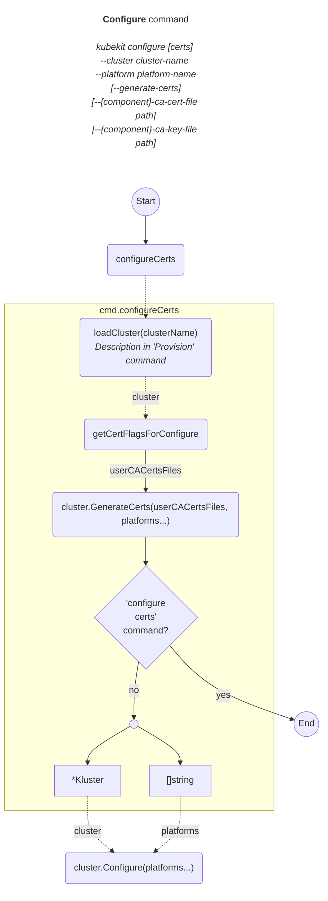

# Diagram Flow

```mermaid
graph TD
  %% Configure command
  %% kubekit configure [certs]
  %%  --cluster cluster-name
  %%  --platform platform-name
  %%  [--generate-certs]
  %%  [--{component}-ca-cert-file path]
  %%  [--{component}-ca-key-file path]
  title["<b>Configure</b> command<br/><br/><i>kubekit configure [certs] <br>--cluster cluster-name <br>--platform platform-name<br>[--generate-certs]<br>[--{component}-ca-cert-file path]<br>[--{component}-ca-key-file path]</i>"]
  title-->start
  style title fill:#FFF,stroke:#FFF
  linkStyle 0 stroke:#FFF,stroke-width:0;

  start((Start)) --> f1("configureCerts")

  f1 -.-> f1.1("loadCluster(clusterName)<br><i>Description in 'Provision' command</i>")
  subgraph cmd.configureCerts


  f1.1 -.cluster.-> f1.2

  f1.2("getCertFlagsForConfigure") --userCACertsFiles--> f1.3("cluster.GenerateCerts(userCACertsFiles, platforms...)")
  
  f1.3 --> CC{'configure<br>certs'<br>command?}
  CC -->|no| r(( ))

  r --> r2[*Kluster]
  r --> r3["[]string"]
  end
  CC -->|yes| e((End))
  
  r2 -.cluster.-> f2("cluster.Configure(platforms...)")
  r3 -.platforms.-> f2
```
