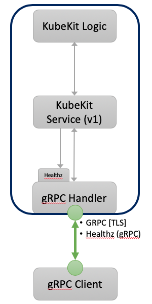
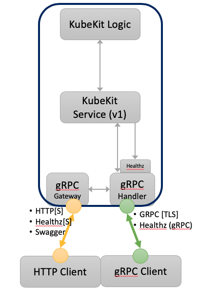
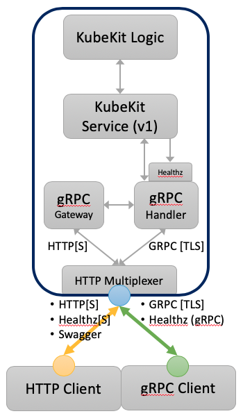

# KubeKit Server

The KubeKit Server is part of the regular `kubekit` binary released. To use it just need to start KubeKit with the parameter `start server` but it could be as simple as that or you can use more options.

The simples way to start the server is:

```bash
kubekit start server
```

The default port for KubeKit Server is 5823 and will serve on localhost. Both parameters can be changed with the flag `--port` and `--host`. 

For example, if the host have more than one IP address and/or you want to serve KubeKit on port 8000, use the following command:

```bash
kubekit start server --host 192.168.0.2 --port 8000
```

You can use the flag `--debug` to get more information, this is useful when testing or debugging the API.

The server expose the API in 3 ways: gRPC only, gRPC and REST/HTTP on different ports each, and gRPC and REST/HTTP on the same port both.

In the following scenarios, for simplicity of the examples, we'll only use the KubeKit version API request; the commands to access the API are `curl`, `grpcurl` and `jq` to make the JSON output pretty; and the server will start in insecure more, not using TLS.

## Exposing gRPC API Only

To expose the gRPC API only use the flag `--no-http`, this will expose the gRPC API and Health Check with gRPC. Like this:

```bash
kubekit start server --no-http
```




By default the gRPC port is **5823** and to choose a different port use the flag `--port`, for example:

```bash
kubekit start server --no-http --port 8000
```

An example to access the gRPC API listening on the default port 5823 and insecure more, would be like this:

```bash
grpcurl -plaintext localhost:5823 kubekit.v1.Kubekit/Version
```

And an example to Check or Watch the Health of the gRPC API service would be:

```bash
$ grpcurl -plaintext localhost:5823 grpc.health.v1.Health/Check
{
  "status": "SERVING"
}

$ grpcurl -plaintext localhost:5823 grpc.health.v1.Health/Watch
{
  "status": "SERVING"
}
```

## Exposing gRPC and REST/HTTP in different ports

Use the following option to expose REST/HTTP and gRPC at the same time. This option is also good if you plan to use just only the REST/HTTP API.

It's not possible to expose just REST/HTTP API for KubeKit and the reason is because REST/HTTP API is exposed through gRPC-Gateway and for this the gRPC API service is required.



To use this option use the flags `--grpc-port` to define the port the gRPC API will be exposed at and optionally `--port` to define the port REST API will be exposed at. By default, if no port for REST API (`--port`) is defined, KubeKit uses the default port: **5823**.

Example:

```bash
kubekit start server --grpc-port 15823 --port 5823
```

To access the gRPC and REST API with the server on insecure mode, using `curl` and `grpcurl`, do something like this:

```bash
# REST:
curl http://localhost:5823/api/v1/version

# gRPC:
grpcurl -plaintext localhost:15823 kubekit.v1.Kubekit/Version
```

The Health service with gRPC is the same as with just gRPC API. To also expose the Health check on REST use the `--healthz-port` flag specifying the port.

```bash
# The server:
kubekit start server --insecure --grpc-port 15823 --port 5823 --healthz-port 5824
```

```bash
# gRPC Check:
grpcurl -plaintext localhost:15823 grpc.health.v1.Health/Check

# gRPC Watch:
grpcurl -plaintext localhost:15823 grpc.health.v1.Health/Watch

# REST Check:
curl http://localhost:5824/healthz/v1/Kubekit
```

Having the REST API, KubeKit also offer the Swagger documentation of the API in JSON format. For this just go to the path `/swagger/kubekit.json` like this:

```bash
curl http://localhost:5823/swagger/kubekit.json
```

If you have Swagger UI installed or the Swagger UI Docker container (see below) you can view the API documentation.

```bash
API_URL=http://localhost:5823/swagger/kubekit.json

docker run -p 80:8080 -e API_URL=$API_URL swaggerapi/swagger-ui
```

Then open `localhost:80` in a browser. 

Running the server in secure mode will cause a security error in the browser, this is normal. Open the Swagger API URL in the same browser ( notice this time it's with HTTPS:  `https://localhost:5823/swagger/kubekit.json`) and follow the steps in your browser to allow this connection. When you see the JSON definition of the API, go back to `localhost:80`.

## Exposing gRPC and REST/HTTP at the same port

This would be the most common scenario offering the best of both worlds and on the same port. 



As this is the default mode, just starting the server without any flag will start the server in this mode. 

```bash
kubekit start server
```

However, other flags can optionally used such as `--healthz-port`,  `--insecure` and `--debug`.

```bash
kubekit start server --healthz-port 5824 --insecure --debug
```

To access the gRPC and REST API is just like in the two previous scenarios but this time using the same port. In this example, let's start the server in secure more (without the `--insecure` flag):

```bash
# REST:
curl --cacert ~/.kubekit.d/server/pki/kubekit-ca.crt https://localhost:5823/api/v1/version

# gRPC:
grpcurl -cacert ~/.kubekit.d/server/pki/kubekit-ca.crt localhost:5823 kubekit.v1.Kubekit/Version
```

The Health check or watch is also exposed on gRPC, and it's exposed on REST/HTTP if the flag `--healthz-port` is used to start the server:

```bash
# gRPC Check:
grpcurl -cacert ~/.kubekit.d/server/pki/kubekit-ca.crt localhost:5823 grpc.health.v1.Health/Check

# gRPC Watch:
grpcurl -cacert ~/.kubekit.d/server/pki/kubekit-ca.crt localhost:5823 grpc.health.v1.Health/Watch

# REST Check:
curl --cacert ~/.kubekit.d/server/pki/kubekit-ca.crt http://localhost:5824/healthz/v1/Kubekit
```

The Swagger API documentation is also exposed. Go to the path `/swagger/kubekit.json` like this:

```bash
curl -k https://localhost:5823/swagger/kubekit.json
```

If you have Swagger UI installed or the Swagger UI Docker container (see below) you can view the API documentation.

```bash
API_URL=https://localhost:5823/swagger/kubekit.json

docker run -p 80:8080 -e API_URL=$API_URL swaggerapi/swagger-ui
```

Then open `localhost` in a browser. 

Running the server in secure mode will cause a security error in the browser, this is normal. Open the Swagger API URL in the same browser ( notice this time it's with HTTPS:  `https://localhost:5823/swagger/kubekit.json`) and follow the steps in your browser to allow this connection. When you see the JSON definition of the API, go back to `localhost`.

## Secure mode and TLS certificates

Most of the examples below were using insecure mode. The server runs in insecure mode when the flag `--insecure` is used. The insecure mode is not recommended on production environments.

So, if it's not recommended, why would you need insecure more?

Well, at developing time we may have some problems and we may not know if the problem is related to the certificates or not. In this case, it's recommended to use insecure mode. Then when the problem is solved, restore the security and make sure everything works in secure mode as well.

Secure mode is about enabling the certificates for the clients communicate to the server using mutual TLS authentication (mTLS). The server and the clients will require such certificates to have a successful communication.

The certificates could be created manually, either self-signed or received from a Certificate Authority, or we can let KubeKit to create the certificates, either self-signed or providing the CA certificate from a Certificate Authority.

### Create your own certificates

When KubeKit Server runs in secure mode it requires mTLS certificates. These could be manually generated  self-signed or provided from a Certificate Authority such as VeriSign, GlobalSign, and others. To deal with certificates provided by a CA is something that you can know from that specific CA and maybe there are different procedures or instructions. This section is about how to generate the self-signed certificates for KubeKit.

KubeKit Server and Clients needs 3 pair of certificates: CA, Server and Client certificates. First you need to generate the CA certificate.

#### Generate CA Certificate

To generate certificates you'll need OpenSSL. If you don't have OpenSSL and you are on MacOS, you can get it with `brew install openssl`. 

Using OpenSSL it's as simple as execute the following code in your terminal:

```bash
TLS_PASSWD=Sup3r!53cret

openssl genrsa -des3 -passout pass:${TLS_PASSWD} -out ca.key 4096 

openssl req -new -x509 -days 365 -key ca.key -out ca.crt -passin pass:${TLS_PASSWD} \
   -subj "/C=US/ST=California/L=San Diego/O=LifeRaft/OU=KubeKit/CN=www.kubekit.io" 
```

The output of these commands are 2 files: the CA key file `ca.key` and the CA certificate file `ca.crt`. The CA key is required to generate the CA certificate.

You can use any subject or certificate information just make sure the `CN` of the CA certificate is different to the `CN` of the following certificates (i.e server and client).

The duration for this CA certificate is one year (`-days 365`), you can increase or decrease it as you please. Same happen with the key bit length, it should be at least 2048 for RAS algorithm (`genrsa`) but `4096` is recommended.  

The password is also optional, if not used still define the variable `TLS_PASSWD` and assign it empty string. Like: `TLS_PASSWD=`. However, it's recommended to have it considering that the production CA certificate will have one.

Both will be used to generate the following certificates: the server and client certificate, either by KubeKit or manually.

#### Server and Client certificates

Both certificates are generated from a CA certificate, this CA certificate could be self-signed (see above) or provided by a Certificate Authority.

The server certificate is used by the KubeKit Server, to generate it with OpenSSL is as simple as:

```bash
SERVER_ADDR=kubekit.local

openssl genrsa -des3 -passout pass:${TLS_PASSWD} -out kubekit.key 4096

openssl req -new -key kubekit.key -out kubekit.csr -passin pass:${TLS_PASSWD} \
  -subj "/C=US/ST=California/L=San Diego/O=LifeRaft/OU=KubeKit/CN=${SERVER_ADDR}”

openssl x509 -req -days 365 -in kubekit.csr -CA ca.crt -CAkey ca.key -set_serial 01 -out kubekit.crt -passin pass:${TLS_PASSWD}
```

The client certificate is used for a client and you can have as many client certificates you want, one for each client is recommended. To generate the client certificate with OpenSSL is similar to generate the server one:

```bash
openssl genrsa -des3 -passout pass:${TLS_PASSWD} -out client.key 4096

openssl req -new -key client.key -out client.csr -passin pass:${TLS_PASSWD} \
  -subj "/C=US/ST=California/L=San Diego/O=LifeRaft/OU=KubeKit/CN=${SERVER_ADDR}”

openssl x509 -req -days 365 -in client.csr -CA ca.crt -CAkey ca.key -set_serial 01 -out client.crt -passin pass:${TLS_PASSWD}
```

The first step for both certificates, is to generate the key. It's very similar to create the CA key, use the same password used to generate the CA and select the appropriate key bit length, `4096` is recommended.

The second step is to generate the CSR or Request for Signing file. It receives the previously created key, the same password used to generate the key and the subject could be the same used to generate the CA certificate but remember to use a different CN, for example, you could the server DNS or IP where KubeKit is running.

It's important the CN match the same IP address or DNS where KubeKit is running. If it's not the same, you'll get a "domain mismatch" error.

The last step is to sign the Certificate Signing Request (CSR) with the self-created Certificate Authority. It uses the same password used to generate the CA key and the duration of the certificate could be a year (`-days 365`) or more. In this example, after a year you have to repeat the same to re-create the keys. When you re-create the certificate make sure to select a different serial key (`-set_serial 01`) or the clients will use the previously cached certificate.

#### Create an insecure (password-less) certificate (Optional)

Sometimes this is required if the client or server does not have the capability to receive the key password. It that's the case, execute the following commands:

```bash
openssl rsa -in kubekit.key -out kubekit.key.insecure -passin pass:${TLS_PASSWD}
mv kubekit.key kubekit.key.secure
mv kubekit.key.insecure kubekit.key
```

Repeat the same for the client certificate.

Do not do this in a production or sensitive environment.

#### Validation

To validate the generated files use OpenSSL as well:

```bash
openssl rsa -noout -text -in kubekit.key
openssl x509 -in kubekit.crt -text -noout
openssl req -noout -text -in kubekit.csr -passin pass:${TLS_PASSWD}

# CA validation:
openssl rsa -noout -text -in ca.key -passin pass:${TLS_PASSWD}
openssl x509 -noout -text -in ca.crt
```

Replace `kubekit.*` for `client.*` to validate the client certificate.

#### Use

Once the certificates are created it's time to let KubeKit Server or Client to use them. The simplest way is to store the certificate in one directory and pass such directory as a parameter using the flag `--cert-dir`, for example:

```bash
kubekit start server --cert-dir /path/to/certs
```

For the client `kubekitctl` is the same flag.

All the files in the directory need to have the correct names, otherwise won't be taken and KubeKit will re-generate the certificates (read next section). The correct names are:

```
kubekit-ca.crt
kubekit-ca.key
kubekit-client.crt
kubekit-client.key
kubekit.crt
kubekit.key
```

If they are not in the same directory, or using different names, you can specify the files with the parameters: `--ca-file`, `--tls-private-key-file` and `--tls-cert-file`. Example:

```bash
kubekit start server \
  --ca-file /path/to/ca.crt
  --tls-private-key-file /path/to/kubekit.key
  --tls-cert-file /path/to/kubekit.crt 
```

The client `kubekitctl` uses the same flags but in this case provide the `client.*` files instead of the servers.

### KubeKit generates the certificates

KubeKit can generate all the certificates for you, it can also generate the missing certificates from others. For example, if you have the CA certificates, KubeKit will generate the server and client certificates from it. If you have the CA Key file, KubeKit will generate the CA certificate for you.

Using the flags `--ca-file`, `--tls-private-key-file` or `--tls-cert-file`, you can specify the existing certificates or keys, and KubeKit will generate the rest. 

If you specify a certificates directory with `--cert-dir` and there are missing certificates or the files does not have the correct names, KubeKit will generate the missing or not found certificates.