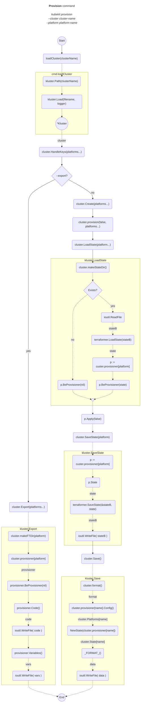

# Diagram Flow

```mermaid
graph TD
  %% Provision command
  %% kubekit provision --cluster <name> --platform <platform>
  title[<b>Provision</b> command<br/><br/><i>kubekit provision <br>--cluster cluster-name <br>--platform platform-name</i>]
  title-->start
  style title fill:#FFF,stroke:#FFF
  linkStyle 0 stroke:#FFF,stroke-width:0;

  start((Start)) --> f1("loadCluster(clusterName)")

  f1 -.-> f1.1("kluster.Path(clusterName)")
  subgraph cmd.loadCluster
  f1.1 -.-> f1.2("kluster.Load(filename, logger)")
  f1.2 -.-> r1((*Kluster))
  end
  r1 -.cluster.-> f2

  f2("cluster.HandleKeys(platforms...)") --> E{--export?}

  E --> |yes|f3("cluster.Export(platforms...)")
  f3 -.-> f3.1("cluster.makeFTDir(platform)")
  subgraph kluster.Export
  f3.1 -.-> s3.1("cluster.provisioner[platform]")
  s3.1 -.provisioner.-> f3.2("provisioner.BeProvisioner(nil)")
  f3.2 -.-> f3.3("provisioner.Code()")
  f3.3 -.code.-> f3.4("ioutil.WriteFile( code )")
  f3.4 -.-> f3.5("provisioner.Variables()")
  f3.5 -.vars.-> f3.6("ioutil.WriteFile( vars )")
  end
  f3.6 -.-> e

  E --> |no|f4("cluster.Create(platforms...)")
  f4 --> f5("cluster.provision(false, platforms...)")
  f5 --> f5.1("cluster.LoadState(platform...)")

  f5.1 --> f5.1.1("cluster.makeStateDir()")
  subgraph kluster.LoadState
  f5.1.1 -.-> ES{Exists?}
  ES -.-> |no| f5.1.2("p.BeProvisioner(nil)")
  f5.1.2 -.-> r2
  ES -.-> |yes| f5.1.3("ioutil.ReadFile")
  f5.1.3 -.stateB.-> f5.1.5("terraformer.LoadState(stateB)")
  f5.1.5 -.state.-> s5.1.1("p := custer.provisioner[platform]")
  s5.1.1 -.-> f5.1.6("p.BeProvisioner(state)")
  f5.1.6 -.-> r2
  end
  r2(( )) -.-> f5.2("p.Apply(false)")

  f5.2 -.-> f5.3("cluster.SaveState(platform)")
  f5.3 -.-> s5.3.1("p := custer.provisioner[platform]")
  subgraph kluster.SaveState
  s5.3.1 -.-> f5.3.1("p.State")
  f5.3.1 -.state.-> f5.3.2("terraformer.SaveState(&stateB, state)")
  f5.3.2 -.stateB.-> f5.3.3("ioutil.WriteFile( stateB )")
  end
  f5.3.3 --> f6("cluster.Save()")

  f6 -.-> f6.1("cluster.format()")
  subgraph kluster.Save
  f6.1 -.format.-> f6.2("cluster.provisioner[name].Config()")
  f6.2 -."cluster.Platforms[name]".-> f6.3("NewState(cluster.provisioner[name])")
  f6.3 -."cluster.State[name]".-> f6.4("_FORMAT_()")
  f6.4 -.data.-> f6.5("ioutil.WriteFile( data )")
  end


  f6.5 -.-> e((End))
```
